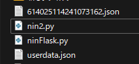
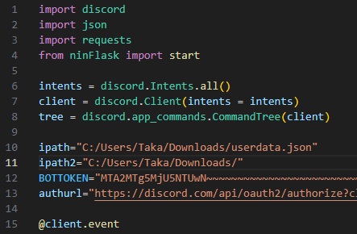
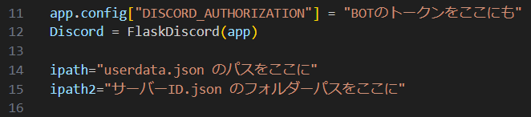

# Discord-Backup-Bot
### ~~⚠️このBotは1サーバー / 1Botを想定してコーディングされています⚠️~~  
↑今は複数のサーバーに対応させたモデルか1サーバーだけのモデルか選べるので関係ないです
### かなりがんばったので宣伝させてください
もしBot/ソースコードを気に入っていただけたら僕のサーバーで寄付(PayPay)してくれると非常に励みになります！！  
Botが対応するので24時間いつでもだいじょうぶです！  
↓サーバー↓ (僕やこのソース/Botを使う方とのコンタクトもここです)  
https://discord.gg/aSyaAK7Ktm  
## Botについて
ソースを公開していますがコーディング、ホスティングの過程を省きたい場合は僕がすでにデプロイしているものを使ってみてください  
↓バックアップBot↓  
https://discord.com/api/oauth2/authorize?client_id=1152222169154199552&permissions=8&scope=bot  
↓メン爆用Bot↓  
https://discord.com/api/oauth2/authorize?client_id=1178210441307115550&permissions=8&scope=bot  
## 2023/11/29：v3リリース！
変更点は以下の通りです  
- /callのコマンド専用のファイルを作り、/callが使われてもBotが停止しなくなりました  
  このコードだと/callは1回しか使えないです、call中に/callを使うとBotから返信されます
  callされているかの判定は同じディレクトリにあるnow.jsonで行っています
- 気持ち程度にstateの引数を暗号化するようにしました
  ここでバラしたら元も子もないですが、URLはそれぞれ16進と8進に変えられてninFlaskV3内でintにデコードします
  
now.jsonは相対パスで入力しているので、変更する必要がある場合はコードの編集ソフトかメモ帳かでnow.jsonを検索してください  
ベースとなっているのはnin2でnin2 -> ninV2 -> ninV3になっています  
通常のnin.pyの機能やninV2aが使いたい方は僕のコードを参考にするなり自分なりに考えるなどで各自編集してください  
## 2023/11/19：429TooManyRequestについて
Replitでホスティングをすると/call時にTooManyRequestが発生するようです  
1回のリクエストにクールタイムは2分ほど必要でまともに使えないのでReplitはこのBotのホスティングに適さないです
## 2023/11/17：チェックボタンを押さなくても認証ができるv2をアップロードしました  
基本的な動作はなにも変わらないのでボタンを押したい方や興味ない方はv1でOKです  
動作させるまでの手順がほんの少しだけ増えたので最後に記載しておきます
## 2023/9/15：サーバーごとに別のファイルに保存するバージョンも作りました
招待は↓から！  
https://discord.com/api/oauth2/authorize?client_id=1152222169154199552&permissions=8&scope=bot  
ローカルに構築するかた向けに最後の方にそっちのセットアップ方法も書いておきます
## Botのセットアップ
#### Pythonを使える環境と脳みそ、Botアカウントの作成と編集ができることが前提に話が進みます

以下のPythonモジュールをインストールしておきます
- discord.py
- requests
- flask
  
Discord Developer Portalにアクセス  
https://discord.com/developers/applications  
名前はなんでもいいのでアプリケーションを作成しましょう  
作成したらまずOAuth2のGeneralからCLIENT IDとCLIENT SECRETを控えておきます  
  
その下にあるRedirectsにFlaskサーバーを建てる場所を入力します  
Flaskサーバーのデフォルトポートは5000なのでポートには5000と記入しておきます  
##### この時末尾に"/"を入れるのを忘れないで！
  
そうしたら1つ下にあるURL GeneratorのSCOPESで"identify"と"guilds.join"を選択、  
SELECT REDIRECT URLにはさっき入力したアドレスを選択して認証に必要なURLを作成しましょう  
このURLも後で使うので控えておきます  
  
最後にBotとして機能するように権限も渡しておいてください  
ここのPrivileged Gateway Intentsの編集を忘れているとそもそもBotがログインできないし、権限も管理者じゃないと機能しません  
もちろんBotなのでBotのトークンもコピーしておいてください  
  
これでDeveloper Portalから必要になる情報は以上です  
いったんDeveloper Portalを離れてローカル環境で編集します
## ローカルでの作業
リポジトリからnin.pyとninFlask.pyをダウンロードします  
このBotはjson形式でユーザー情報を保存するので好きなところに好きな名前でjsonファイルを作ってください  
この時作ったjsonファイルには {} とだけ記載しておいて、jsonとしてちゃんと機能するようにしておいてください  
- 僕は"userdata.json"という名前で作成しました
  
そうしたらエディターかメモ帳かでnin.pyとninFlask.pyを開きます  
- 僕はVisual Studio Codeを使いました
  
nin.pyとninFlask.py両方に記入欄があるので、記入欄に書いてある情報を入力していきます  
上に貼り付けた僕の環境では下の画像のようになりました  
###### nin.py
  
###### ninFlask.py

  
これで2つとも保存すれば編集はおしまいです！おつかれさまでした！  
nin.pyを実行すればBotが稼働します！  
Botをサーバーに参加させて動作確認してみてください！
### サーバーに接続できない、500が返される
- ちゃんとポートが開放されているかチェックしてください
- 自分のグローバルIPに自分のグローバルIPから接続することはできません、ローカルで動作チェックをするならローカルIPを使ってください  
### /callや/request1をしてもユーザーの追加に失敗する
- Botが参加していないサーバーには参加させることができません
- 追加しようとしたあいてがアプリケーション認証を切っていると追加できません  
  対策もありません、もういっかい認証してもらうしかないです
### ロール付与に失敗する
- Botにそのロールを付与する権限があるか確認してください  
  また、付与できる状態かどうかも確認してください
## Botコマンド
- button  
  登録リンクとロール付与のボタンを表示します  
  タイトルと説明を省くとテンプレートの文章を送ります
- call  
  jsonに保存されたユーザー全員を追加します、誤爆には充分気をつけてください
- request1  
  指定したIDのユーザーを追加します  
  サーバーIDを入力するとBotが参加している別のサーバーにも参加させることができます
- check  
  指定したユーザーIDの情報が登録されているか確認します
- datacheck  
  jsonに何人の情報が登録されているか確認します
- delkey  
  指定したユーザーIDの登録情報を削除します
## コンタクト
#### サポートサーバー  
https://discord.gg/aSyaAK7Ktm  
僕のDiscord -> .taka.  
###### 余談ですがこのREADMEを書いてる途中に停電してデータふっとびました、悲しいです  
###### わかりにくいとこがあったら指摘していただけるとありがたいです

## サーバーごとに別ファイルを作る版、nin2の使い方
  
こんな感じでuserdata.jsonの他にサーバーID.jsonも作ってくれるバージョンです  
/callを使うとき、データサーバーIDの欄にIDを入力すると入力したIDのサーバーで登録したひとだけが追加されます  
nin.pyとの違いはipath2にサーバーID.jsonが保存される"フォルダーのパス"を入力することくらいです  
私の環境では↓のようになりました  
  
これだけでuserdata.json(全サーバーごっちゃのデータ)とサーバーID.json(IDのサーバーで登録したひとだけのデータ)の両方が作成され  
マルチサーバーに対応させることができるようになりました  
ninFlask.pyはそのままでだいじょうぶです

## チェックボタンを押す必要のなくなったv2の使い方
Flask Discord Extendedが必要になります  
- pip install Flask-Discord-Extended
  
FlaskのファイルにもBotのトークンとipath2の入力が必要になりました
  
これだけです  
バグとかおかしなとこがあれば連絡してくれると非常に助かります！！  
##### v2alphaについて  
nin(Flask)V2aのファイルはロールIDの受け渡しがjson経由になったものです  
機能の変更はありませんがalpha版じゃないものとalpha版は混同して使うことができないので気をつけてください
