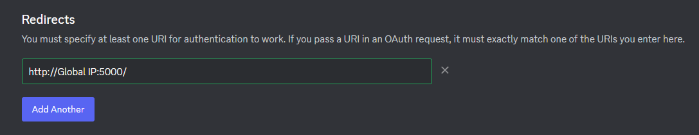
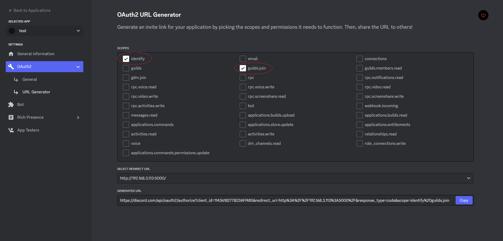
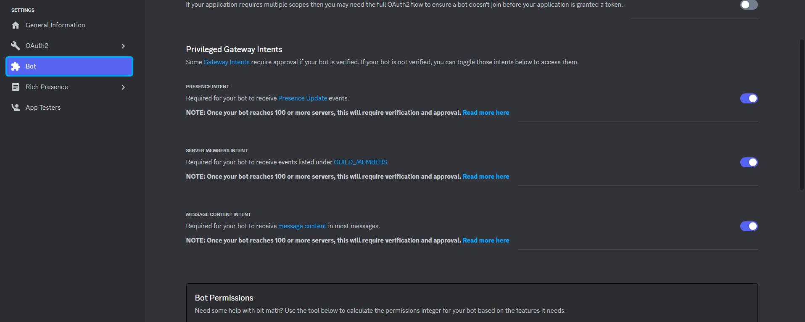
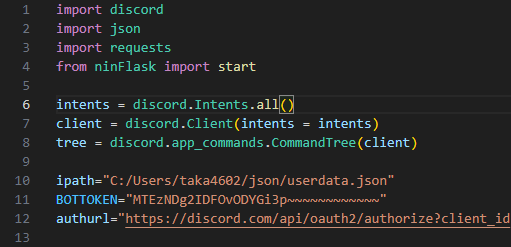
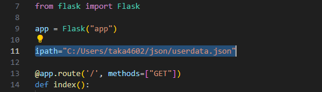
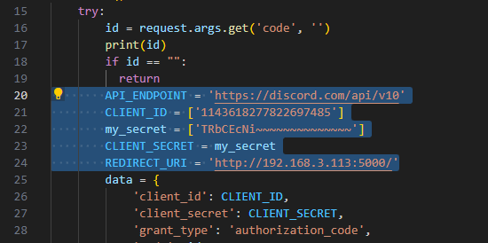

# Discord-Backup-bot
### ⚠️このBotは1サーバー / 1Botを想定してコーディングされています⚠️
## Botのセットアップ
#### Pythonを使える環境と脳みそ、Botアカウントの作成と編集ができることが前提に話が進みます
##### もし動作を知りたいなら↓
https://discord.com/api/oauth2/authorize?client_id=1143678795526717501&permissions=8&scope=bot  
から稼働中のBotを追加して観察したらいいと思います  

以下のPythonモジュールをインストールしておきます
- discord.py
- requests
- flask
  
Discord Developer Portalにアクセス  
https://discord.com/developers/applications  
名前はなんでもいいのでアプリケーションを作成しましょう  
作成したらまずOAuth2のGeneralからCLIENT IDとCLIENT SECRETを控えておきます  
  
その下にあるRedirectsにFlaskサーバーを建てる場所を入力します  
Flaskサーバーのデフォルトポートは5000なのでポートには5000と記入しておきます  
##### この時末尾に"/"を入れるのを忘れないで！
  
そうしたら1つ下にあるURL GeneratorのSCOPESで"identify"と"guilds.join"を選択、  
SELECT REDIRECT URLにはさっき入力したアドレスを選択して認証に必要なURLを作成しましょう  
このURLも後で使うので控えておきます  
  
最後にBotとして機能するように権限も渡しておいてください  
ここのPrivileged Gateway Intentsの編集を忘れているとそもそもBotがログインできないし、権限も管理者じゃないと機能しません  
もちろんBotなのでBotのトークンもコピーしておいてください  
  
これでDeveloper Portalから必要になる情報は以上です  
いったんDeveloper Portalを離れてローカル環境で編集します
## ローカルでの作業
リポジトリからnin.pyとninFlask.pyをダウンロードします  
このBotはjson形式でユーザー情報を保存するので好きなところに好きな名前でjsonファイルを作ってください  
この時作ったjsonファイルには {} とだけ記載しておいて、jsonとしてちゃんと機能するようにしておいてください  
- 僕は"userdata.json"という名前で作成しました
  
そうしたらエディターかメモ帳かでnin.pyとninFlask.pyを開きます  
- 僕はVisual Studio Codeを使いました
  
nin.pyとninFlask.py両方に記入欄があるので、記入欄に書いてある情報を入力していきます  
上に貼り付けた僕の環境では下の画像のようになりました  
###### nin.py
  
###### ninFlask.py

  
これで2つとも保存すれば編集はおしまいです！おつかれさまでした！  
nin.pyを実行すればBotが稼働します！  
Botをサーバーに参加させて動作確認してみてください！
### サーバーに接続できない、500が返される
- ちゃんとポートが開放されているかチェックしてください
- 自分のグローバルIPに自分のグローバルIPから接続することはできません、ローカルで動作チェックをするならローカルIPを使ってください  
### /callや/request1をしてもユーザーの追加に失敗する
- Botが参加していないサーバーには参加させることができません
- 追加しようとしたあいてがアプリケーション認証を切っていると追加できません  
  対策もありません、もういっかい認証してもらうしかないです
### ロール付与に失敗する
- Botにそのロールを付与する権限があるか確認してください  
  また、付与できる状態かどうかも確認してください
## Botコマンド
- button  
  登録リンクとロール付与のボタンを表示します
  タイトルと説明を省くとテンプレートの文章を送ります
- call  
  jsonに保存されたユーザー全員を追加します、誤爆には充分気をつけてください
- request1  
  指定したIDのユーザーを追加します
  サーバーIDを入力するとBotが参加している別のサーバーにも参加させることができます
- check  
  指定したユーザーIDの情報が登録されているか確認します
- datacheck  
  jsonに何人の情報が登録されているか確認します
- delkey  
  指定したユーザーIDの登録情報を削除します
## コンタクト
#### サポートサーバー  
https://discord.gg/eyngej5NeK  
僕のDiscord -> .taka.  
###### 余談ですがこのREADMEを書いてる途中に停電してデータふっとびました、悲しいです  
###### わかりにくいとこがあったら指摘していただけるとありがたいです
